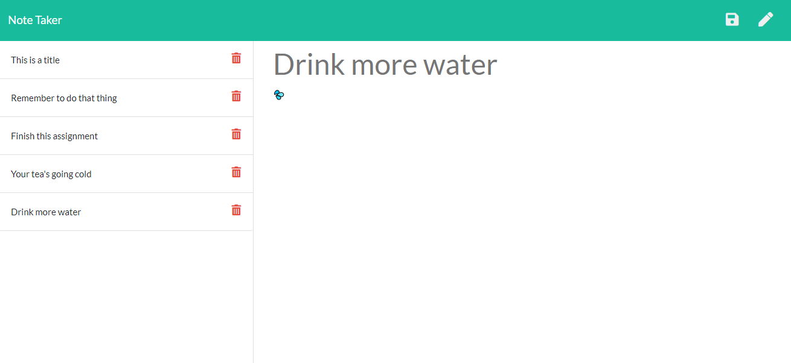

# Express Note Taker

This project serves solely as a means to learn about Express. I was given some front-end code, a specification, and wrote the server-side code to listen out for requests and serve the appropriate response. 

It uses the HTTP methods `GET`, `POST` and `DELETE` in order to retrieve existing notes, create new notes and delete notes. I used the UUID module to create a unique ID for every note, which is how the delete method is able to work.

## Finished product

